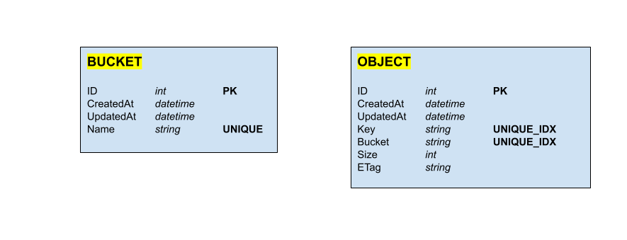

# S3 Storage prototype
AWS S3 compatible file storage service created with GO and PostgreSQL.
The service uses the following data model:

The service enables three actions:
- create a bucket - creates a new bucket in buckets table.
- create an object (in a bucket) - saves file to the disc and saves metadata about the file in the objects table.
- list objects - enables querying objects information for a given bucket.

### Structure
- __internal/db__ - general database abstraction interface and Postgres connection implementation.
- __internal/handlers__ - business logic for handling requests.
- __internal/models__ - database models definition.
- __internal/routes__ - API's routes definition.

### Start project
Prerequisites: to start the project you need to have Docker installed.

1. Change `.env.example` to `.env`
2. To run the server open terminal and type: `docker compose up`
3. The server should be running on `localhost:8080`

If you want to restart the database type in terminal: `docker compose down --volumes`

### TODOs
- [x] Setup project
- [x] Setup Docker with PostgreSQL
- [x] Implement API abstraction
- [x] Implement Database abstraction and connection
- [x] Implement Create Bucket Handler
- [x] Implement Create Object Handler
- [x] Implement List Objects Handler
- [x] Finish TODOs in code
- [x] Test S3 compability
- [x] Refactor code